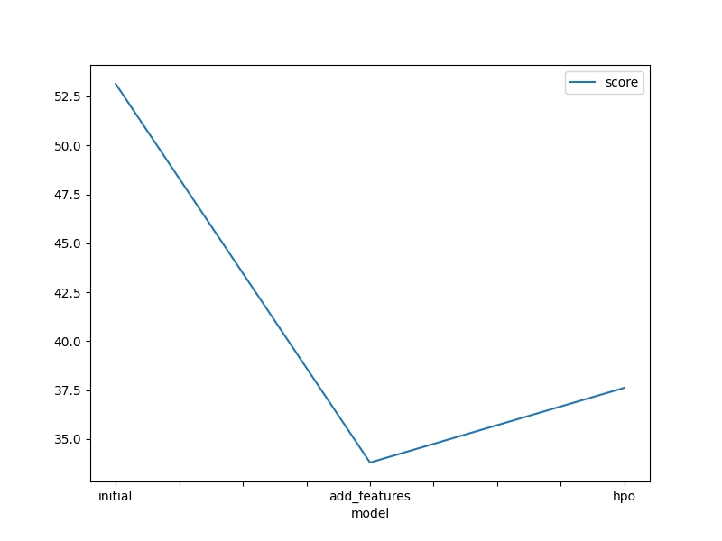
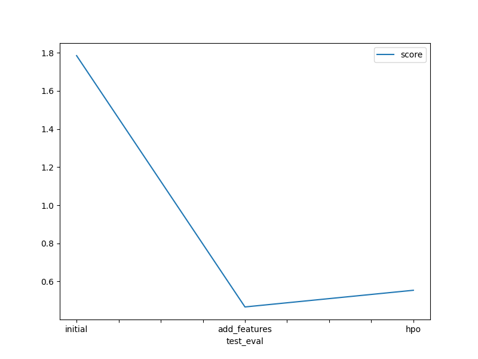

# Report: Predicting Bike Sharing Demand with AutoGluon

## Initial Training
### Submission Realizations and Required Adjustments
**Experiments Conducted:**
1. Raw Submission Model: **[Model: `initial`]**
2. Enhanced Features Submission (EDA + Feature Engineering): **[Model: `add_features`]**
3. Hyperparameter Optimization (HPO) - Initial Setting Submission: **[Model: `hpo`]**

**Observation:** During the submission process, some experiments yielded negative prediction values. 
**Adjustments Made:** Kaggle rejects submissions containing negative prediction values. Therefore, all negative predictions from the respective models were replaced with 0 to meet the submission requirements. 

### Top-Ranked Model Performance
The top-performing model was the `(add features)` model named `WeightedEnsemble_L3`, which achieved a **validation RMSE score** of **33.802673** and the highest **Kaggle score** of **0.46648 (on the test dataset)**. This model was trained using exploratory data analysis (EDA) and feature engineering without hyperparameter optimization. Although hyperparameter tuning led to improvements in RMSE scores on validation data, this model excelled in performance on the unseen test dataset. Model selection was based on both RMSE (cross-validation) and Kaggle (test data) scores.

*Note: In AutoGluon, RMSE scores are presented as negative values in Jupyter notebooks to rank them by highest scores, requiring multiplication by '-1' to obtain accurate RMSE values. As a result, RMSE values in the notebook may appear negative.*

## Exploratory Data Analysis and Feature Creation
### Findings and Additional Feature Implementation
- Parsed the `datetime` feature to extract hour information from timestamps.
- Converted `season` and `weather` features from integer to categorical data types.
- Extracted `year`, `month`, `day` (day of the week), and `hour` from the `datetime` feature, dropping the original `datetime` feature.
- Discovered that `casual` and `registered` features were strongly correlated with the target variable `count`, leading to improved RMSE scores during cross-validation. However, these features were excluded during model training due to their absence in the test dataset.
- Added a `day_type` feature based on `holiday` and `workingday` to categorize into "weekday," "weekend," and "holiday."
- Dropped the `atemp` feature due to its high correlation (0.98) with `temp` to reduce multicollinearity.
- Conducted data visualization for deeper insights into feature relationships.

### Performance Improvement from Additional Features
- The introduction of additional features enhanced model performance by approximately 138% compared to the initial/raw model.
- Converting categorical variables from integer to their true categorical types and excluding highly correlated features like `atemp` contributed to improved model performance.
- Breaking down the `datetime` feature into separate components and adding `day_type` allowed the model to better capture seasonality and historical patterns.

## Hyperparameter Tuning
### Performance Enhancement Through Hyperparameter Tuning
Hyperparameter tuning positively impacted model performance compared to the initial submission. Although models with optimized hyperparameters showed competitive results, the model with EDA and additional features performed better on the Kaggle (test) dataset.

**Observations:**
- While using AutoGluon, the prescribed hyperparameter settings were considered, but optimized models performed sub-optimally due to limited tuning options.
- The `time_limit` and `presets` parameters in AutoGluon are crucial; insufficient time limits may prevent models from being built effectively.

### Future Work
With more time, further exploration of extended AutoGluon runs with high-quality presets and enhanced hyperparameter tuning could provide additional insights and improvements.

### Summary Table of Models and Hyperparameters
| Model | HPO1 | HPO2 | HPO3 | Kaggle Score |
|-------|------|------|------|--------------|
| Initial | Prescribed values | Prescribed values | "Presets: 'high quality' (auto_stack=True)" | 1.78459 |
| Add Features | Prescribed values | Prescribed values | "Presets: 'high quality' (auto_stack=True)" | 0.46648 |
| HPO (top-hpo-model: hpo2) | Tree-Based Models: (GBM, XT, XGB & RF) | KNN | "Presets: 'optimize_for_deployment'" | 0.55394 |

### Line Plots
- **Top Model Training Scores:**

- **Top Kaggle Scores for Prediction Submissions:**

## Summary
- The AutoGluon AutoML framework was effectively utilized for the bike sharing demand prediction project, allowing for automated stacking and distinct regression models on tabular data.
- The top model, leveraging EDA and feature engineering, demonstrated significant improvement over the initial model and performed best on the Kaggle test dataset.
- While hyperparameter tuning offered some performance gains, it was less effective compared to models that did not use hyperparameter optimization.
- Hyperparameter tuning in AutoGluon is a complex process, dependent on time limits, presets, model families, and hyperparameter ranges.

---
